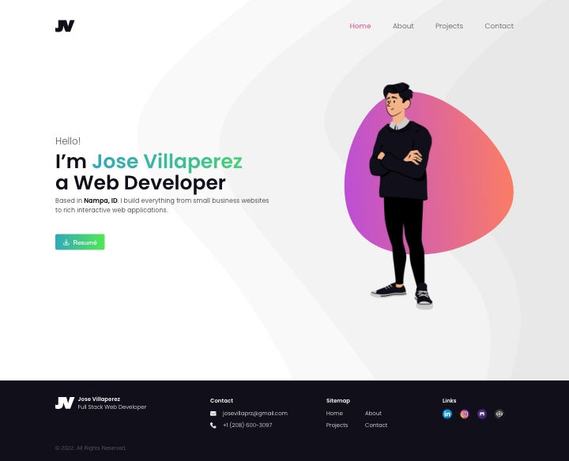
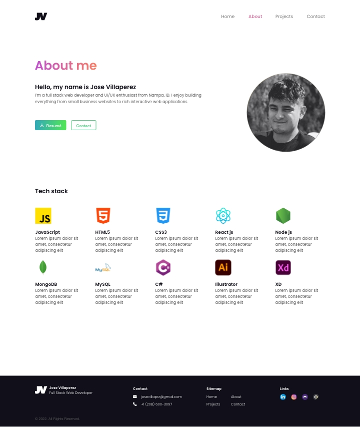
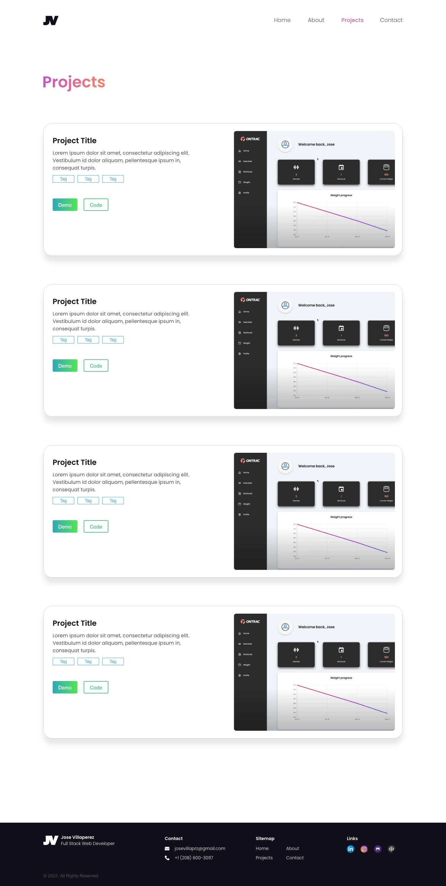
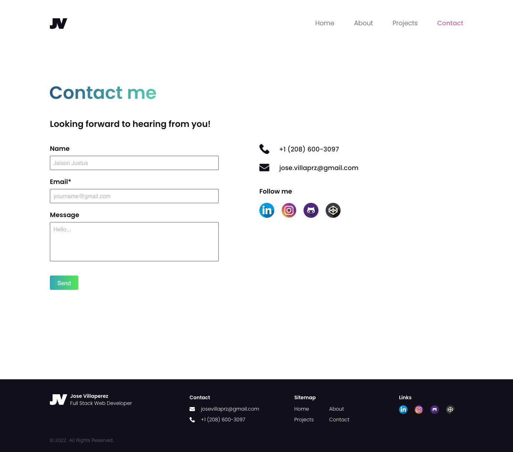

# Professional Portfolio
This repository contains all the files and project for my professional portfolio.

 

## Portfolio Status

### Week 1
This week I started planning out my page content based on my target audience. Once I had a written plan proposal, I began creating wireframes for how my site would be laid out. After creating my rough wireframes I began converting them into hifidelity mockups.

### Week 2
For week 2, I began working on setting up my react app and file structure. After having that set up I moved onto creating my components for my site. I am currently finishing out creating my pages with the components I created.

 

## Portfolio Designs
Here are the portfolio mockup designs.

#### Home page

#### About page

#### Projects page

#### Contact page
